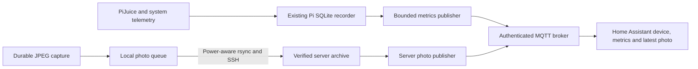

# Home Assistant integration

The camera integrates through Home Assistant's native MQTT discovery, sensor and
camera platforms. No custom Home Assistant component is required. The Pi publishes
small metric snapshots; the archive server publishes the latest original JPEG
that passed the existing upload receipt checks. Viewing Home Assistant uses that
cached image and never requests a capture or wakes the Pi.

Configure the Home Assistant address, broker credentials and archive destination
before live commissioning. Configuration and systemd templates are provided.
Charging is independent of this integration. No charging, shutdown, camera-trigger
or shell-command MQTT subscriptions are provided.

## Data path



Home Assistant supports grouped device discovery and raw JPEG camera messages.
The implementation uses those built-in platforms and stable unique identifiers.
[MQTT discovery](https://www.home-assistant.io/integrations/mqtt/#mqtt-discovery),
[MQTT camera](https://www.home-assistant.io/integrations/camera.mqtt/).

All originals remain in the archive and follow the existing receipt protocol.
MQTT delivers the latest image for display; it is not the photo archive and its
PUBACK is not a durable archive receipt. No resizing, recompression, timelapse
rendering or other image processing is performed.

## Device and entities

The discovery document groups 25 entities under one camera device: 22 current
sensors, the latest-photo camera, a historical capture timestamp, and a diagnostic
publisher-connection entity. Five estimates/diagnostics are disabled by default,
leaving 20 enabled entities.

| Group | Entities |
| --- | --- |
| Power | Battery voltage; Pi voltage, current and watts; USB/GPIO source status; battery status |
| Estimates, disabled initially | Battery percentage, battery current, battery watts and reported battery temperature |
| System | CPU temperature, available memory, load, uptime, clock source, observation timestamp, telemetry error count |
| Storage | Pending/stored photographs, spool bytes and free bytes |
| Images | Latest uploaded photograph and last uploaded capture timestamp |
| Diagnostic connection | Whether the telemetry publisher is presently connected; normally off between bursts |

Units and measurement classes follow the corresponding Home Assistant sensor
schema. Missing or invalid data renders unknown instead of zero. Current sensor
state is deliberately **not retained**: retaining an old state can refresh its
expiry after a Home Assistant restart. Sensors expire after 900 seconds without
a new published observation by default.
[MQTT sensor behavior](https://www.home-assistant.io/integrations/sensor.mqtt/).

Battery percentage/current/power are estimates that depend on the installed
battery profile. Reported battery temperature may be MCU fallback temperature;
it is not a verified pouch probe. These are diagnostic values, not charging-control inputs.
Panel/input watts and energy totals are absent because they have not been measured
by calibrated external sensors.

The camera and its metadata are retained at the broker, so the latest archived
image remains viewable while the Pi is asleep, disconnected or its telemetry has
expired. Its capture timestamp and time-source attributes distinguish a historic
photo from a live stream. An UNSYNC capture has an unknown historical timestamp
sensor but retains its original metadata for diagnosis.

## Runtime and freshness

`python -m timelapse.ha` runs one bounded operation and exits. The only optional
runtime dependency is pinned `paho-mqtt==2.1.0`. The MQTT library runs in a short-lived
worker process so DNS, connect and publish cannot leave the command hanging.
TLS certificate/hostname verification is enabled by default; credentials are read
from a private file, never passed as command-line passwords. Every publication
uses QoS 1 and is checkpointed only after acknowledgments. A failure is retried on
a later timer invocation; no unbounded reconnect loop runs on the Pi.
[Paho client API](https://eclipse.dev/paho/files/paho.mqtt.python/html/client.html).

The telemetry timer runs about every five minutes while Linux is awake. It reads
the existing database and spool without extra I2C sampling, camera work or JPEG
hashing. A sample must be from the current boot and at most 420 seconds old,
allowing the recorder's existing five-minute commit interval. Synced timestamps
are checked too. UNSYNC samples can use valid monotonic freshness but publish an
unknown observation timestamp. The integration does not backfill old SQLite rows
into Home Assistant's history; those records remain available for offline analysis.

With external input absent or bad, a small telemetry burst requires at least
3.70 V battery voltage. This is an initial communications reserve, not a battery
capacity or safe-discharge qualification. It does not override capture/transfer
power guards. No automatic Wi-Fi enabling or RTC wake has been added.

The archive publisher runs about every minute on the server. Identical unchanged
photo metadata is suppressed; a distinct capture updates even if its JPEG bytes
are identical. Retained discovery is refreshed every five minutes; an unchanged
photo is refreshed hourly to repair a lost broker cache. Each role has separate
local state and MQTT client IDs. Changed broker/device configuration invalidates
the checkpoint. Failed sends do not advance it.

Receiver updates maintain `device/latest.json` atomically after a durable receipt.
Normal image lookup then reads a constant number of files and verifies only the
selected JPEG. Legacy archives can be indexed once using `reindex` below. Scans
and payloads are bounded; originals are never deleted automatically.

Latest-photo selection prefers captures marked `NTP` or `RTC`, ordered by capture
UTC and then filename. If no such capture exists, `UNSYNC` photos are ordered by
the server receipt's storage UTC and then filename. An incorrect future timestamp
from an unsynchronised camera cannot keep that photo selected indefinitely. New
`UNSYNC` originals still enter the archive, but the last trusted capture stays
visible until another trusted capture arrives. Incremental index updates, reindex,
and legacy lookup all use this same ordering.

Metadata and receipt records each have a 64 KiB limit, including their exact JSON
encoding and trailing newline. Oversized upload metadata is rejected before any
commit writes. The latest-photo index has a separate limit of 129 KiB.
Pre-existing records above these limits fail explicitly; the receiver never
truncates or deletes them. They require deliberate archive metadata repair or
migration before reindexing.

## Prerequisites and identity

1. A reachable Home Assistant installation with its MQTT integration enabled.
2. An authenticated MQTT broker, preferably TLS, with persistent retained storage.
3. A Linux archive server already receiving originals through the
   [camera transfer workflow](camera-workflow.md). Use the same `device_id` for
   uploads and discovery. The server and broker may run alongside Home Assistant.
4. The Pi recorder and a current Python 3.11+ installation. The Pi remains ARMv6;
   Home Assistant itself belongs on the server, not a Pi Zero.

Choose one stable unique device ID, such as `timelapse-zero-01`, and preserve it
through reboots, IP changes and software upgrades. Use it on both publisher hosts.
Use separate broker users for telemetry and archive photos. The supplied
`deploy/home-assistant/mosquitto.acl.example` permits each role to write only its
own topics and discovery. Home Assistant reads those topics. Match IDs/users in
the ACL to the actual configuration.

The broker example uses TLS port 8883, password authentication, persistent data
and a 9 MiB payload limit for the default 8 MiB photo cap. Adapt certificate paths,
server hostname and filesystem permissions to the installed broker. If increasing
`photos.max_bytes`, increase the broker limit too. TLS keys and password files
must stay private; no anonymous public listener is needed.
[Mosquitto configuration](https://mosquitto.org/man/mosquitto-conf-5.html).

## Install the publishers

Use a reviewed checkout of this repository at `/opt/pi-home-assistant` on each
publisher host. This is separate from the existing capture deployment directory.
Create its environment and install only the MQTT extra:

```sh
sudo python3 -m venv /opt/pi-home-assistant/.venv
sudo /opt/pi-home-assistant/.venv/bin/python -m pip install '/opt/pi-home-assistant[homeassistant]'
sudo install -d -m 0700 /etc/pi-home-assistant
sudo install -m 0600 /opt/pi-home-assistant/deploy/home-assistant/config.example.json /etc/pi-home-assistant/config.json
sudoedit /etc/pi-home-assistant/config.json
```

On minimal Raspberry Pi OS, install the distribution's `python3-venv` package if
needed. Preserve an existing config rather than copying
the example over it during upgrades. Reinstall the package after updating its
checkout; the isolated environment does not automatically track source edits.

Set `device_id`, broker hostname, username, CA path and password-file path. Keep
`tls: true` and ensure the hostname matches the server certificate. With a public
CA, `ca_file` can be null to use system trust. Client certificates are optional but
require both `cert_file` and `key_file`. Plaintext must be deliberately enabled
with `tls: false` and a matching port, and is suitable only for a trusted isolated
network; certificate verification cannot be switched off while TLS is enabled.

Create `/etc/pi-home-assistant/mqtt-password` using an editor, with mode 0600,
containing just the password. Do not place it in this repository or the JSON file.
The telemetry unit runs as root to read the existing private recorder and spool.
The server photo unit runs as `timelapse`; use the actual archive-owning account
if different, and make its configuration, password and client key readable only
by that account. For the example server account:

```sh
sudo chown -R timelapse:timelapse /etc/pi-home-assistant
```

On the Pi install only the telemetry units; on the archive server install only
the photo units. Example for the Pi:

```sh
sudo install -m 0644 /opt/pi-home-assistant/deploy/home-assistant/pi-home-assistant-telemetry.service /etc/systemd/system/
sudo install -m 0644 /opt/pi-home-assistant/deploy/home-assistant/pi-home-assistant-telemetry.timer /etc/systemd/system/
sudo systemctl daemon-reload
```

Use the corresponding `photos` filenames on the archive server. Set its
`photos.archive_root` to the canonical absolute receiver root, such as
`/srv/pi-timelapse`, not the per-device subdirectory or a symlink. Server config
must use the archive broker user while preserving the same device ID/topic names.
Both templates restrict filesystem writes to publisher state, apply a low process
priority and cap runtime. Neither timer is enabled by installing its files.

## Commission before enabling timers

Preview discovery without broker access, then register it. Allow Home Assistant to
create the device before publishing its first state:

```sh
/opt/pi-home-assistant/.venv/bin/python -m timelapse.ha --config /etc/pi-home-assistant/config.json discovery
/opt/pi-home-assistant/.venv/bin/python -m timelapse.ha --config /etc/pi-home-assistant/config.json register --role telemetry
```

Run as root on the Pi or as the configured service account on the server. Use
`register --role photos` with the archive account. In Home Assistant, open Settings
→ Devices & services → MQTT and confirm the grouped camera device exists. Its
sensor entities can initially be unavailable; battery estimates are intentionally
in the disabled-entity list.

Home Assistant processes discovery asynchronously. Publishing a non-retained state
immediately after the first discovery can precede its subscription.
Registration before the initial snapshot avoids relying on that race; following
HA/broker restarts, the next fresh scheduled snapshot restores current data. Broker ACK alone cannot prove HA processed a value.

Preview a current snapshot on the Pi, then send one bounded publication:

```sh
sudo /opt/pi-home-assistant/.venv/bin/python -m timelapse.ha --config /etc/pi-home-assistant/config.json telemetry --dry-run
sudo /opt/pi-home-assistant/.venv/bin/python -m timelapse.ha --config /etc/pi-home-assistant/config.json telemetry --force
```

On the archive server, preview and publish its latest committed image:

```sh
sudo -u timelapse /opt/pi-home-assistant/.venv/bin/python -m timelapse.ha --config /etc/pi-home-assistant/config.json photos --dry-run
sudo -u timelapse /opt/pi-home-assistant/.venv/bin/python -m timelapse.ha --config /etc/pi-home-assistant/config.json photos --force
```

Check that measured values, observation time, image and capture timestamp agree
with source records. Add the discovered camera entity to a native picture-entity
card, and the required sensors to entities/history cards. Dashboard entity names
come from Home Assistant's registry and can be renamed there without changing
stable unique IDs.

After that check, enable each timer on its respective host:

```sh
sudo systemctl enable --now pi-home-assistant-telemetry.timer
```

Use `pi-home-assistant-photos.timer` on the server. For existing archives, update
the server receiver code and rebuild its index once:

```sh
printf '%s\n' '{"protocol":1}' | python3 -m timelapse.receiver reindex --root /srv/pi-timelapse --device timelapse-zero-01
```

Automatic original-photo uploads still need their existing destination and measured
power policy commissioned. Enabling MQTT metrics does not bypass those guards or
enable uploads, capture, charging or power cycling.

## Recovery, history and removal

Use `journalctl -u pi-home-assistant-telemetry.service` or the photo service on the
appropriate host. A stale recorder snapshot fails locally without network access.
A broker failure leaves its checkpoint unadvanced. An oversized/corrupt archived
JPEG leaves the previously retained image intact; repair the archive and retry.
Use `--force` for a deliberate republish after replacing a broker or clearing caches.

Keep the original SQLite records for historical analysis. Home Assistant sensor
history is based on received state changes, not a retrospective import of the Pi's
minute-by-minute samples. Tune its recorder retention on the server; do not create
a false energy meter from estimated battery current.

To remove the device, first stop both publishers on their respective machines:

```sh
sudo systemctl disable --now pi-home-assistant-telemetry.timer
sudo systemctl stop pi-home-assistant-telemetry.service
```

Repeat for `photos` on the server, then run `remove --role telemetry --apply` with
the telemetry config and `remove --role photos --apply` with the archive config.
This clears their retained discovery/state/image topics within their ACLs. It does
not delete photos, telemetry databases or receipts. Either running publisher can
recreate discovery, so both must be stopped first. Re-registering later requires
`--force` on the first content publication because local deduplication state remains.

## Validation and commissioning

Run the repository checks and the opt-in integration harnesses before
commissioning a deployment. See the [project quickstart](../README.md)
for the repository test commands.

MQTT 3.1.1 acknowledgments alone are not a portable proof that ACLs allowed delivery;
commissioning checks actual Home Assistant state and broker logs.

Reproduce the opt-in test with Docker available:

```sh
python3 ops/verify_home_assistant.py --run --output /tmp/home-assistant-acceptance.json
python3 ops/verify_mqtt_security.py --run --output /tmp/home-assistant-mqtt-security.json
```

The script uses only its isolated test containers/network and synthetic data, then
removes them. This does not validate a deployment's broker, credentials, Wi-Fi energy,
physical battery or full original-photo transfer. Those deployment checks remain
separate from protocol acceptance.
